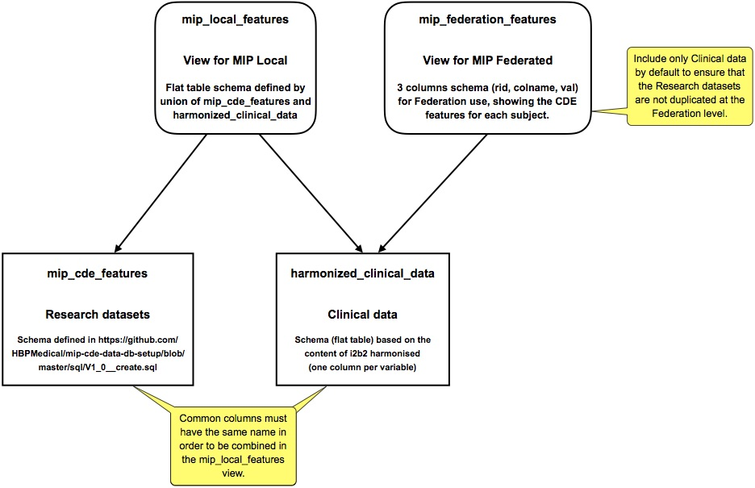

# PostgresRAW-UI: Web UI and file sniffer for PostgresRAW

PostgresRAW-UI offers the following functionalities:

- Web UI for PostgresRAW
- REST API for PostgresRAW
- Automatic detection and registration of raw files (sniffer)
- Automatic MIP view creation

The automatic file registration watches a folder provided as an argument when starting the server. When files appear or are modified in this folder, the corresponding tables are automatically made available in the database. If needed, the MIP views are adapted to the changes of their underlying files.


1. [Running PostgresRAW-UI](#running-postgresraw-ui)
2. [Using the sniffer with PostgresRAW](#using-the-sniffer-with-postgresraw)
3. [MIP views creation](#mip-views-creation)

## Running PostgresRAW-UI

Requirements:

 * python 2.7
 * flask
 * requests
 * psycopg2

PostgresRAW-UI is launched using the command:

```sh
$ python sniff_server/server.py (args)
```

For the list of the arguments to be provided, type:

```sh
$ python sniff_server/server.py --help
```

Here is an example command to start the server:

```sh
$ python server.py --reload \
    --pg_raw \
    --host ${POSTGRES_HOST} \
    --port ${POSTGRES_PORT} \
    --user ${POSTGRES_USER} \
    --password ${POSTGRES_PASSWORD} \
    --dbname ${POSTGRES_DB} \
    --folder /datasets \
    --snoop_conf_folder /data
```

This example assumes that:

 * PostresRAW is used
 * `POSTGRES_*` environment variables are defined and link to PostgresRAW
 * PostgresRAW configuration file is expected to be found in `/data`
 * the watched folder (containing raw data files to be automatically registered) is `/datasets`
 * the folder containing the NoDB configuration file is `/data`, and the file itself is found in `/data/pgdata/snoop.conf`

To see the web UI, browse http://localhost:5555. 

## Using the sniffer with PostgresRAW

In PostgresRAW mode, the sniffer of PostgresRAW-UI detects CSV files in the folder given by the **folder** argument. The inferrer module then infers their schema and creates corresponding dummy tables in the given database **dbname** (more details below). 

The sniffer also registers the associations `{file; dummy table}` through a configuration file named `snoop.conf`. This file is created in the **snoop\_conf\_folder**. PostgresRAW expects to find the configuration file in its data folder (as defined by `PGDATA`), so the **snoop\_conf\_folder** argument must give the path of that folder. Please refer to the [PostgresRAW](https://github.com/HBPMedical/PostgresRAW) project for more information.

Using the sniffer of PostgresRAW-UI, no schema has to be defined manually in the database for the raw CSV files. Rather, the structure of data made available for querying in the watched folder is translated in real time to a database schema based on the following rules:

- For each `[name].csv` file discovered in **datasets**, an equivalent table is made available in the Query Engine for querying. The table name is based on the file name, with the following rules uppercase characters are transformed to lowercase and any special character removed (except underscore '\_').

	Here are two examples:

	 1. A file named `Brain_Feature_Set.csv` is accessed through a table named **`brain_feature_set`**.
	 2. A file named `B%dExämp|e.csv` will be exposed through a table named **`bdexmpe`**.

- The column names are retrieved from the header line of the CSV file, without modifications. It is highly recommended to stick to simple lowercase names in order to access data seamlessly. Columns of CSV files without header are named by default `_1`, `_2`, `_3`, etc…

- The type of each data feature (column) is inferred based on the first lines of the file, as one of the following types: *int*, *real*, *boolean* or *text*. Data not fitting any of the specialised types defaults to *text* type. Empty values are recognised as *NULL*s.

- The CSV file delimiter is expected to be a comma (`,`). Other standard delimiters used in a consistent way should be recognised automatically. The double quote character (`"`) must be used for text quoting (and escaping). NULL values are represented with an empty unquoted string (for instance with comma delimiters : `,,`).

Note: files without a `.csv` extension are not recognised as CSV.

## MIP views creation

In the context of the MIP, data will be stored in two tables:

- `mip_cde_features` contains the research data loaded in the database,
- `harmonized_clinical_data` gives access to the clinical data pre-processed by the MIP and stored in a csv file named "harmonized\_clinical\_data.csv".

The "harmonized\_clinical\_data.csv" file is dropped in PostgresRAW data folder and automatically detected and registered by the sniffer.

Further, views are automatically created to display the data in the format required for MIP Local and MIP Federated. The views are named:

- `mip_local_features`
- `mip_federation_features`

The view `mip_local_features` displays all the underlying data in a unified flat-table schema. All the columns existing in the underlying tables are included (once). By default, the underlying tables are `mip_cde_features` and `harmonized_clinical_data`, but this can be adapted using the `--local_data_source` option (default value: "mip\_cde\_features harmonized\_clinical\_data"; list tables without comma or other separators).

The view `mip_federation_features` displays the underlying data in a 3-columns star schema. The columns are named "rid", "colname" and "val". By default, the data displayed for the Federation is only the clinical data, i.e. the `harmonized_clinical_data` table. This can be adapted using the `--fed_data_source` option (default value: "harmonized\_clinical\_data").

This option must be used at one node to display the research data once at the Federation level.

Following the requirement of the Federation, the `mip_federation_features` view includes the CDE features for each subject, and only the CDE features. Missing CDE features are included as records with a "NULL" value in the "val" column.

The following schema represents the default configuration for the MIP views.




